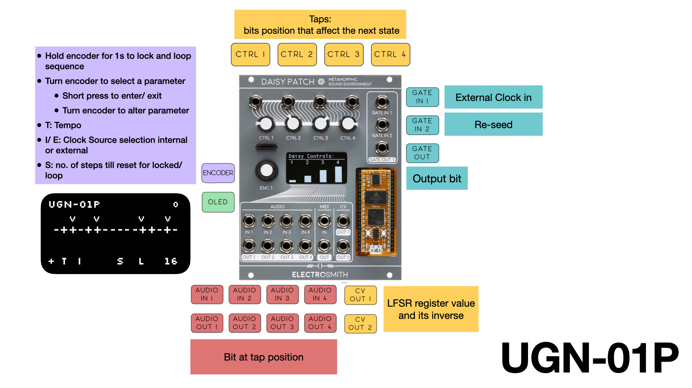

# UGN-01P
playable 16-bit linear-feedback shift register

## Description

## Controls
| Control | Description | Comment |
| --- | --- | --- |
| Ctrl 1 - 4 | CV Inputs | Tap position. Ctrl as scaler when there is CV input. |
| Gate In 1 | Ext Clock | External clock input. |
| Gate In 2 | Re/seed | Seed LFSR with new value. |  
| Encoder | Menu Navigation | Turn to navigate, push to edit, turn to change, push to confirm. Long press to lock shift register.|
| Gate Out | BIT OUT | LFSR shift bit gate out. |
| CV Out 1 - 2 | LFSR Register Outs | CV Output of LFSR register value and its inverse respectively |
| Audio Out 1 - 4 | Tap bit gate AND Output | Bit state at n-th tap && IN n-th individually. |

## Compiling
You should either 1) put this folder one level from your libdaisy and DaiySP directory. e.g. ../DaisyExamples/patch/ or, 2) edit Makefile to point to the library locations (full path) of libdaisy or DaisySP.
